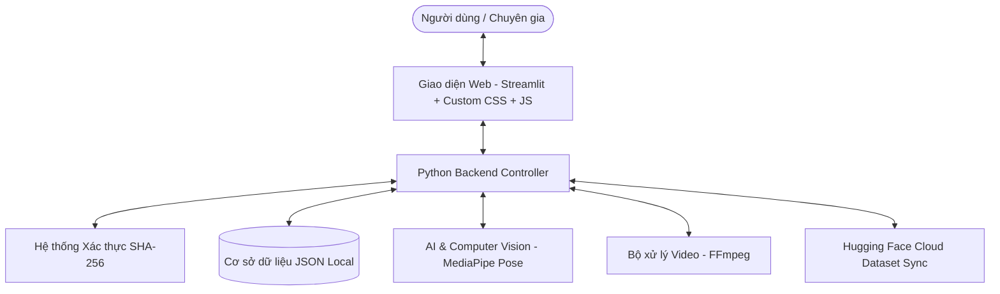

# TÀI LIỆU CHI TIẾT KIẾN TRÚC FRONTEND VÀ BACKEND HỆ THỐNG
## HỆ THỐNG GIÁM SÁT TẬP LUYỆN PHỤC HỒI CHỨC NĂNG (REHAB AI MONITOR)

Tài liệu này trình bày chi tiết về kiến trúc kỹ thuật của hệ thống **Rehab AI Monitor**, bao gồm cả phần giao diện người dùng (Frontend) và logic xử lý ngầm (Backend) cùng các công nghệ AI đi kèm.

---

## 1. TỔNG QUAN KIẾN TRÚC HỆ THỐNG

Hệ thống được phát triển theo mô hình **Full-stack tích hợp** bằng ngôn ngữ **Python** kết hợp với framework **Streamlit**. Sự kết hợp này giúp đồng bộ hóa logic AI và hiển thị trực quan dữ liệu mà không cần thông qua các tầng API trung gian phức tạp, tối ưu hóa tốc độ xử lý video trên hạ tầng máy chủ Cloud hoặc máy trạm cục bộ.

---

## 2. CHI TIẾT PHẦN FRONTEND (GIAO DIỆN NGƯỜI DÙNG)

Frontend của ứng dụng được xây dựng dựa trên các thành phần trực quan của Streamlit, kết hợp với các kỹ thuật **CSS Injection** và **JavaScript Injection** sâu để tạo ra trải nghiệm người dùng cao cấp (Premium UX).

### 2.1. Thiết kế Giao diện & Thẩm mỹ (UI/UX)
* **Phong cách Thiết kế Hiện đại:** Sử dụng ngôn ngữ thiết kế phẳng pha trộn xu hướng kính mờ (Glassmorphism), viền phát sáng (glow border) cho các biểu tượng logo học viện và các khối banner thông tin.
* **Đồng bộ hóa Chủ đề (Theme Sync):** Hệ thống tự động phát hiện và đồng bộ màu sắc văn bản, màu nền thẻ card, nút bấm theo 2 chế độ:
  * **Dark Mode (Chế độ Tối):** Nền tối sâu `#0d0d1a`, văn bản trắng, viền neon xanh cyan `#00c6ff` tạo cảm giác công nghệ cao.
  * **Light Mode (Chế độ Sáng):** Nền trắng `#ffffff`, chữ đen `#000000`, viền xám mỏng và các nút bấm chuyển sắc xanh dịu mắt.
* **Tương thích Thiết bị Di động (Mobile Responsive):**
  * Tự động điều chỉnh kích cỡ của 3 logo trên đầu trang từ `100px` xuống `70px` và cố định trên 1 hàng (`flex-wrap: nowrap`) để tránh bị đẩy xuống dòng trên màn hình hẹp.
  * Thiết kế lại thanh Tab điều hướng dạng cuộn ngang (`overflow-x: auto`) mượt mà trên điện thoại.
  * Giảm cỡ chữ của toàn bộ Sidebar xuống `0.88rem` để tăng mật độ thông tin hiển thị trên màn hình nhỏ.

### 2.2. Các Phân hệ Giao diện theo Vai trò (Role-based Dashboards)
* **Giao diện Bệnh nhân:**
  * Form khai báo thông tin hành chính (Họ tên, tuổi, giới tính, mã định danh).
  * Khu vực khai báo triệu chứng lâm sàng và thang đo mức độ đau (VAS từ 0 đến 10).
  * Trình phát video bài tập chuẩn mẫu đối chiếu và video YouTube hướng dẫn.
  * Khu vực kéo-thả để tải video tập luyện cá nhân lên hệ thống.
* **Giao diện Bác sĩ / Kỹ thuật viên PHCN:**
  * Bảng theo dõi danh sách bệnh nhân và trạng thái video (Chờ đánh giá, Đã đánh giá, Chờ AI xử lý).
  * Trình xem video bài tập của bệnh nhân song song với biểu đồ góc khớp sinh học do AI phân tích.
  * Form nhập liệu nhận xét lâm sàng chuyên môn (Ground Truth) để lưu vào hồ sơ bệnh án.
* **Giao diện Nghiên cứu viên (AI Researcher):**
  * Bảng điều khiển cấu hình tham số AI (Ngưỡng tự tin, Tốc độ bỏ qua khung hình để tăng tốc xử lý, Độ phân giải video, Loại mô hình Pose).
  * Bộ trích xuất dữ liệu thô và biểu đồ tọa độ 33 điểm xương khớp.
* **Giao diện Quản trị viên (Admin Panel):**
  * Bảng quản lý người dùng: Thống kê số lượng, chức năng tạo mới hoặc xóa tài khoản.
  * Bảng hiển thị Nhật ký Hoạt động hệ thống (System Logs) kèm chức năng tải về dạng CSV.
  * Phân khu dọn dẹp hệ thống (Xóa video tạm, reset cơ sở dữ liệu).

---

## 3. CHI TIẾT PHẦN BACKEND (LOGIC & XỬ LÝ DỮ LIỆU)

Phần Backend hoạt động hoàn toàn bằng Python dưới nền, thực hiện các tác vụ nặng về tính toán hình học, quản lý tệp tin và bảo mật.

### 3.1. Hệ thống Cơ sở dữ liệu và Xác thực
* **Cơ sở dữ liệu JSON:** Lưu trữ cấu trúc dạng phẳng (Flat File) thông qua các tệp tin JSON chuyên biệt:
  * `users.json`: Lưu thông tin tài khoản người dùng, email, mã số sinh viên/bệnh nhân, vai trò và mật khẩu đã mã hóa.
  * `video_list.json`: Quản lý siêu dữ liệu video (Đường dẫn lưu trữ, độ chính xác AI, thời gian tải lên, trạng thái phân tích).
  * `patient_symptoms.json`: Lưu thông tin khai báo sức khỏe và mức độ đau VAS của bệnh nhân.
  * `doctor_evaluations.json`: Lưu trữ kết quả chẩn đoán, lời khuyên và kế hoạch điều trị từ bác sĩ.
  * `schedules.json` & `lich_su_tap_luyen.json`: Lưu lịch nhắc nhở và nhật ký tập luyện.
* **Xác thực bảo mật:** Sử dụng thuật toán băm **SHA-256** qua thư viện `hashlib` của Python để mã hóa mật khẩu trước khi lưu trữ, đảm bảo không lưu mật khẩu dạng văn bản thuần (plaintext).

### 3.2. Core xử lý AI & Thị giác máy tính (Computer Vision)
* **MediaPipe Pose Engine:** 
  * Sử dụng phiên bản **MediaPipe Heavy Model** (Complexity 2) để tăng tối đa độ chính xác của việc nhận diện 33 điểm mốc khớp xương, đặc biệt hữu ích trong môi trường lâm sàng có nhiều vật cản.
  * Áp dụng kỹ thuật lọc làm mượt dữ liệu (Data Smoothing) để giảm nhiễu rung lắc của camera điện thoại.
* **Thuật toán hình học sinh học (Joint Angle Calculation):**
  * Sử dụng lượng giác để tính góc giữa 3 điểm mốc xương (Ví dụ: Vai - Khuỷu - Cổ tay để tính góc khuỷu tay).
  * Công thức tính góc dựa trên tích vô hướng của hai vector khớp:
    $$\theta = \arccos\left(\frac{\vec{u} \cdot \vec{v}}{\|\vec{u}\| \|\vec{v}\|}\right) \times \frac{180}{\pi}$$
  * So sánh trực tiếp góc của bệnh nhân theo thời gian với góc chuẩn từ dữ liệu mẫu lâm sàng để tính toán sai số Euclidean và đưa ra độ chính xác phần trăm (Accuracy Score).

### 3.3. Engine xử lý Video & Tối ưu hóa đám mây
* **Tích hợp FFmpeg:** Gọi trình xử lý FFmpeg thông qua Python `subprocess` để tự động mã hóa (transcode) và nén video của bệnh nhân sang codec chuẩn **H.264 (MP4)** với mức bitrate tối ưu (800kbps) và độ phân giải phù hợp, giúp video có thể phát mượt mà trên tất cả các trình duyệt di động mà không gây nghẽn băng thông.
* **Hugging Face Cloud Dataset Sync:** Tự động đồng bộ các video và kết quả phân tích lên bộ lưu trữ đám mây của Hugging Face theo cơ chế bất đồng bộ (Asynchronous thread) để tránh làm nghẽn luồng xử lý chính của người dùng, giải quyết triệt để vấn đề mất dữ liệu khi máy chủ Docker của Space khởi động lại.
* **Quản lý bộ nhớ đệm chống tràn RAM (OOM Prevention):**
  * Gọi bộ dọn rác hệ thống `gc.collect()` định kỳ sau mỗi lần phân tích AI.
  * Tự động xóa các file khung hình ảnh tạm thời sau khi trích xuất dữ liệu tọa độ hoàn tất.

---

## 4. BẢNG TỔNG HỢP SO SÁNH CÔNG NGHỆ

| Thành phần | Công nghệ sử dụng | Vai trò chính |
| :--- | :--- | :--- |
| **Frontend UI** | Streamlit + Custom CSS | Hiển thị giao diện điều khiển, biểu đồ trực quan hóa, video phát trực tuyến. |
| **Responsive Logic** | CSS Media Queries | Định dạng lại layout di động, co giãn kích thước logo và khoảng cách. |
| **Tab Controller** | Segmented Control + JavaScript | Điều hướng tab thông minh, tự động chuyển tab theo tác vụ. |
| **Database** | JSON Files | Cơ sở dữ liệu nhẹ, truy xuất nhanh, dễ dàng đồng bộ lên đám mây. |
| **Authentication** | hashlib (SHA-256) | Mã hóa mật khẩu người dùng, kiểm soát phân quyền đăng nhập. |
| **AI Engine** | MediaPipe (Pose Landmark) | Nhận dạng 33 điểm khớp xương người trên video thời gian thực. |
| **Video Engine** | FFmpeg | Nén, tối ưu hóa và chuyển đổi định dạng video sang chuẩn web H.264. |
| **Cloud Sync** | Hugging Face Dataset API | Đồng bộ hóa dữ liệu bền vững chống reset môi trường. |
